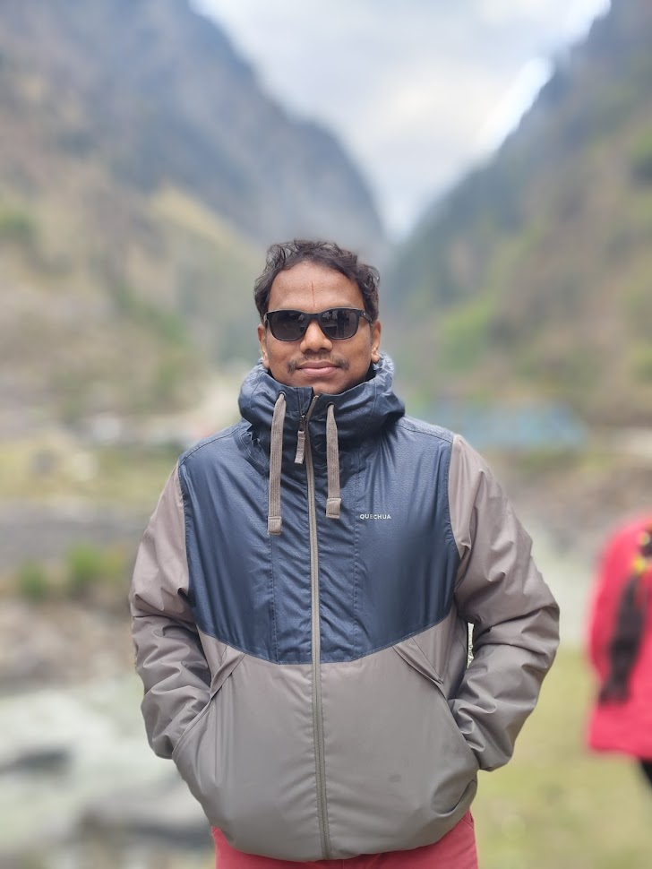

# Srinivas_doctor.github.io

# 🩺 Dr. Sreenivas – Ayurveda & Naturopathy Portfolio Website

A modern, responsive, single-page portfolio website designed for **Dr. Sreenivas**,  
Course Director & HOD (Integrative Medicine), and Director of *Shri Lakshmi Ayurvedha Nilayam*.

The website is built using **pure HTML, Tailwind CSS (CDN), and JavaScript**, and is deployed **100% free** using **GitHub Pages**.

---

## 🌐 Live Website
👉 https://n-sathwik.github.io/Srinivas_doctor.github.io/

---

## ✨ Features

- ✅ Fully responsive (Mobile, Tablet & Desktop)
- ✅ Modern UI with Tailwind CSS
- ✅ Smooth animations using AOS (Animate on Scroll)
- ✅ Hero section with doctor profile image
- ✅ Photo gallery with category filters
- ✅ Fullscreen lightbox image viewer
- ✅ Embedded YouTube video section
- ✅ WhatsApp appointment booking (no backend)
- ✅ Google Maps clinic location link
- ✅ SEO-friendly structure
- ✅ 100% static & free hosting

---

## 🛠️ Tech Stack

- **HTML5**
- **Tailwind CSS (CDN)**
- **JavaScript (Vanilla JS)**
- **Font Awesome Icons**
- **Google Fonts**
- **AOS Animation Library**
- **GitHub Pages (Hosting)**

---

## 📁 Project Structure

/
├── index.html # Main website file
├── README.md # Project documentation
├── doctor.jpg # Doctor profile image (if added)
└── images/ # (Optional) Gallery images


> ⚠️ Note: The main file must be named **index.html** (lowercase) for GitHub Pages to work.

---

## 🚀 Deployment (100% Free)

This website is deployed using **GitHub Pages**.

### Steps:
1. Create a public GitHub repository
2. Upload `index.html` (and images if any)
3. Go to **Settings → Pages**
4. Select:
   - Branch: `main`
   - Folder: `/root`
5. Save & wait 1 minute

Your site will be live 🎉

---

## 📷 Images & Media

- Profile image is loaded locally:
```html


📞 Contact & Appointment

📱 Phone: +91 99084 66929

📍 Location: Peddapalli, Telangana

📩 WhatsApp booking integrated (no backend required)

🎥 YouTube Channel linked

👨‍💻 Developer

Designed & Developed by:
Sathwik
📧 Email: sathwikn699@gmail.com

📜 License

This project is created for professional portfolio use.
All rights reserved © 2024 Dr. Sreenivas.


---

### ✅ What to do now
1. Create a file named **`README.md`**
2. Paste the content above
3. Commit changes

If you want, I can also:
- Optimize SEO meta tags
- Reduce image size for faster loading
- Add custom domain setup
- Improve gallery lightbox logic

Just tell me 👍
